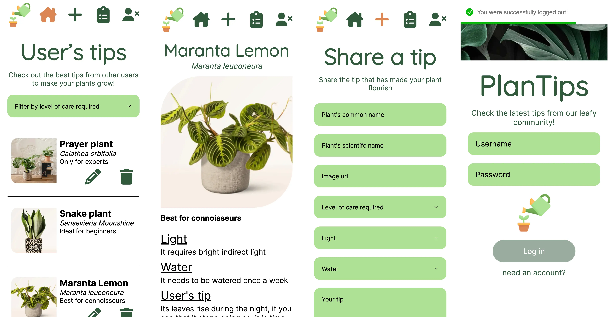

# PlanTips

Plantips is a website that allows plant lovers to check and share the best tips to help plants grow stronger.
It is built using React, Redux toolkit, styled components, and tested using Jest. The application has been deployed in Netlify.

[PlanTips app](https://anna-marrodan-final-project-202301.netlify.app/login)

## Features

- Users can log in to the application and acces the general list of tips and their private list.
- Users can browse through the general collection of tips and filter by level of care required.
- Users can create and share their plant-growing tips with other users.
- Users can delete their own tips.

## Tech stack

- React: frontend library for building web applications
- Redux Toolkit: a library that provides a simple and efficient way to manage application state
- Styled components: popular library used to style React applications. It allows to write actual CSS code to style custom components
- Jest: a popular JavaScript testing framework
- React testing library: popular JavaScript library used for testing React applications.

## Future implementations

- Allow users to modify its own tips
- Allow new users to register

## Getting Started

To get started using Plantips, you'll need to have the following tools installed:

- Node.js
- Clone the repository and install all the needed dependencies using _npm install_

This is a full stack project, you can find the backend code here: [Platips back end project](https://anna-marrodan-final-project-202301.netlify.app/login)

## Running Tests

Plantips uses Jest for unit and integration tests. To run the test suite, use the _npm test_ command.

## Deployment

To deploy Plantips to a production environment, run the npm _run build_ command to build a production-ready version of the app. This will generate a build directory containing the compiled code, which you can then serve using a static file server.
